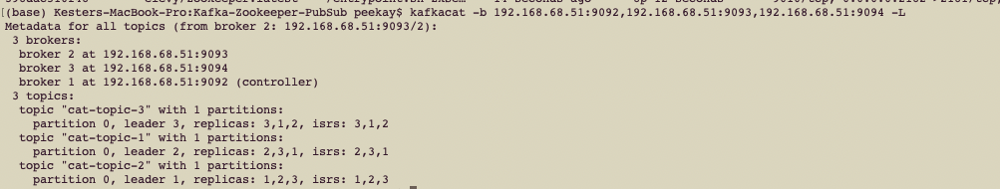
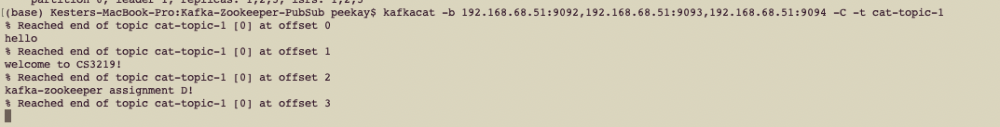

# Kafka-Zookeeper-PubSub

## Introduction

The following repository demonstrates the use of pub-sub pattern using kafka and zookeepers. The following uses a 3-node Apache Kafka cluster along with a zookeeper ensemble that consists of 3 zookeepers or controllers.

## Dependencies

1. `Docker`

2. `docker-compose`

3. `kafkacat`

## Set-Up

1. Ensure that you have `docker`, `docker-compose` and `kafkacat` installed. If not, please install them respectively as we will be using docker images and a docker-compose file. Also will use kafkacat for interacting with brokers.

2. The `docker-compose.yml` file contains several configurations -> one for zookeeper and one for kafka nodes. If you are using `docker-desktop`, please use your own private IP address for `KAFKA_ADVERTISED_HOST_NAME` and change it for all kafka containers (kafka-1, kafka-2 and kafka-3). For mine, I specifically used `192.168.68.51` as it is my own IP address. If you are using `docker-machine`, then change to the container's IP address. Default IP address for `docker-machine` is `192.168.99.100`. See image below for more information.
   

3. Once you correctly configure the kafka host name to the correct one. Then run `docker-compose up -d` at the same directory as the compose file.

4. The current `docker-compose` file depends on two images which are `wurstmeister/kafka` and `elevy/zookeeper` images from the docker registry. Hence you will be pulling these two images and the containers will be runned and the servers will be online. Do take note, you may need to wait few seconds for this step before everything is running normally. To check, type in `docker ps` to see if 6 containers (3 for zookeepers and 3 for kafka are running).

5. Now assuming all are going smoothly, we can now use kafkacat to see the current online brokers as well as the topics currently created. Type `kafkacat -b 192.168.68.51:9092,192.168.68.51:9093,192.168.68.51:9094 -L` to list current brokers that are online and the topics created. I specified all broker's IP address and port number just in case. You can actually just use one eg `kafkacat -b 192.168.68.51:9092 -L` would work as well. Do take note for the second section that if you killed the broker or node that holds that IP address and port number then it will fail. So best to use all 3 at once to avoid such cases. Do take note you need to change the above IP Address to the one you specified on step 2 which may be `192.168.99.100` if you are using docker-machine. You should see the following result. The list should contain 3 brokers and 3 topics called cat-topic-1 to 3! Love cats! If you have any error such as `insecurity protocol..` or the topics are not created, please give a few more seconds or so as the containers are setting up. 
   

6. Yay! Everything is now running smoothly! Now move on to the next two sections!

## Pub-Sub Messaging

We shall now use this to demonstrate pub-sub messaging! We shall use `cat-topic-1` topic in this section! Feel free to try using other topics as well!

1. Let's use `kafkacat` to create a consumer of `cat-topic-1`! Type this command in the terminal `kafkacat -b 192.168.68.51:9092,192.168.68.51:9093,192.168.68.51:9094 -C -t cat-topic-1`. You should get the following output:
   
   As there is no producer publishing any message to this topic, you can see it reaches end of topic offset 0 which means it is empty.

2. Now let's use `kafkacat` to create a producer that will publish messages to `cat-topic-1`! Type this command in another terminal window `kafkacat -b 192.168.68.51:9092,192.168.68.51:9093,192.168.68.51:9094 -P -t cat-topic-1`. You won't see any output as it is expecting input from you! Type in anything you like and press `enter` to publish a message to the topic. Please open another terminal or command prompt window for this as step 1 will block the current terminal window. See below image for reference!
   

3. Now head over to the terminal or command prompt window where you created a consumer. You should see the message being received and printed along with its offsets!
   

Congrats! You have successfully did a pub-sub with kafka! Zookeepers will come in the next section! Please do not terminate the commands from step 2 and 3 as the next section uses it.

## Zookeeper

Now this section explains how the current set-up handles failover using 3 node kafka and zookeepers. Essentially, when the leader node or controller dies, then zookeeper will assign another node randomly to be the next leader node and set the remaining nodes to be leaders of each topic. This ensures that pub-sub still works and failover management is repeatable in case another leader node dies. Let's get into it!

PLEASE CONTINUE FROM THE PREVIOUS SECTION AND DO NOT TERMINATE THE PRODUCER OR CONSUMER processes from step 2 and 3 of the previous section respectively. ALSO CREATE A NEW TERMINAL WINDOW FOR THIS SECTION TO TERMINATE THE LEADER NODE.

1. Remember when you listed all the brokers. Do it again! And see which is your controller! With reference to the image below, the leader node or controller is broker 1. May differ from yours!
   

2. Now let's kill off that node. Type `docker ps` and locate the docker container that corresponds to that leader node. Then type `docker rm -f DOCKER_CONTAINER_ID` to stop and remove that container. See image below:
   
   According to the image, my controller is kafka-1 and the container id is `3a29f976a69a` and hence I call `docker rm -f 3a29f976a69a` to kill off that node.

3. Now type `kafkacat -b 192.168.68.51:9092,192.168.68.51:9093,192.168.68.51:9094 -L` and you should see now only two kafka containers is running. Do note that the list may not be updated immediately, please wait a moment and try again till you see that only 2 kakfka containers remain running.
   
   As seen in the image, zookeeper will assign another broker or node to be the leader or controller and set the leader of each partition to the currently online brokers or nodes.

4. Now using the producer and consumer, try to produce any messages. And the pub-sub still works the same in the earlier section! See below images!
   
   

YAY! Even if the main node dies, it passes off to another running node and the whole thing continues as planned! And this is how it handles failover!

## Close it down

1. Simply type `docker-compose down -v` to shutdown all containers!

Thank you for reading on!
